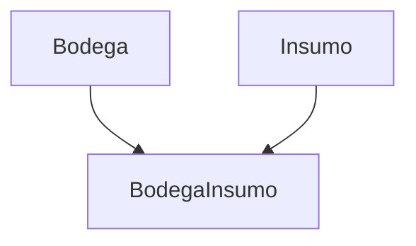

# **Gestión de Bodega Insumo**

Los **registros de Bodega Insumo** documentan la relación entre insumos y bodegas, incluyendo la cantidad disponible de cada insumo en una bodega específica. Esta documentación cubre los endpoints RESTful y las conexiones WebSocket para su gestión.

## **Endpoints de la API**

### **Obtener todas las relaciones entre bodegas e insumos**

**Método:** `GET`

**URL:**
```
http://127.0.0.1:8000/inventario/bodega_insumo/
```

**Parámetros opcionales:**
- `?bodega=1`: Filtra por ID de bodega.
- `?insumo=2`: Filtra por ID de insumo.

**Ejemplo de respuesta (200 OK):**
```json
[
  {
    "id": 1,
    "bodega": 1,
    "insumo": 2,
    "cantidad": 10
  }
]
```

---

### **Obtener una relación específica por ID**

**Método:** `GET`

**URL:**
```
http://127.0.0.1:8000/inventario/bodega_insumo/{id}/
```

**Ejemplo de respuesta (200 OK):**
```json
{
  "id": 1,
  "bodega": 1,
  "insumo": 2,
  "cantidad": 10
}
```

---

### **Registrar una nueva relación entre bodega e insumo**

**Método:** `POST`

**URL:**
```
http://127.0.0.1:8000/inventario/bodega_insumo/
```

**Ejemplo de solicitud:**
```json
{
  "bodega": 1,
  "insumo": 2,
  "cantidad": 15
}
```

**Validaciones:**
- Campos obligatorios: `bodega`, `insumo`
- `cantidad` debe ser un entero

**Ejemplo de respuesta (201 Created):**
```json
{
  "id": 2,
  "bodega": 1,
  "insumo": 2,
  "cantidad": 15
}
```

---

### **Actualizar una relación entre bodega e insumo**

**Método:** `PUT`

**URL:**
```
http://127.0.0.1:8000/inventario/bodega_insumo/{id}/
```

**Ejemplo de solicitud:**
```json
{
  "cantidad": 12
}
```

**Restricciones:**
- Solo se puede modificar `cantidad`

**Ejemplo de respuesta (200 OK):**
```json
{
  "id": 1,
  "bodega": 1,
  "insumo": 2,
  "cantidad": 12
}
```

---

### **Eliminar una relación entre bodega e insumo**

**Método:** `DELETE`

**URL:**
```
http://127.0.0.1:8000/inventario/bodega_insumo/{id}/
```

**Ejemplo de respuesta exitosa (204 No Content):**
```json
{}
```

---

## **WebSocket**

**Conexión:**
```
ws://127.0.0.1:8000/inventario/bodega_insumo/
```

Permite actualizaciones en tiempo real de las relaciones entre bodegas e insumos.

### **Estado inicial:**
```json
{
  "action": "initial_state",
  "bodega_status": [
    {
      "id": 1,
      "bodega": "Bodega Central",
      "insumo": "Fertilizante",
      "cantidad": 10
    }
  ]
}
```

### **Eventos en tiempo real:**

#### **Creación/Actualización:**
```json
{
  "message_id": "create-1-uuid-aqui",
  "id": 1,
  "bodega": "Bodega Central",
  "insumo": "Fertilizante",
  "cantidad": 10,
  "accion": "create"
}
```

#### **Eliminación:**
```json
{
  "message_id": "delete-1-uuid-aqui",
  "id": 1,
  "accion": "delete"
}
```

---

## **Manejo de Errores**

### **Ejemplo de error (404 Not Found):**
```json
{
  "detail": "No encontrado."
}
```

### **Ejemplo de error (400 Bad Request):**
```json
{
  "error": "Bad Request",
  "detail": "El campo 'cantidad' debe ser un entero."
}
```

---

## **Buenas Prácticas**
✔️ **Registro inmediato:** Actualizar la cantidad tras cada movimiento de insumos.  
✔️ **Detalles específicos:** Verificar que la cantidad coincida con el inventario físico.  
✔️ **Sincronización:** Usar WebSocket para reflejar cambios en tiempo real en el frontend.  

---

## **Integraciones Comunes**
▸ **Notificaciones:** Alertas cuando la cantidad de insumos cae por debajo de un umbral.  
▸ **Inventario:** Actualización automática del stock en `Insumo` al modificar `BodegaInsumo`.  
▸ **Reportes:**  
  - Disponibilidad por bodega  
  - Histórico de movimientos de insumos  

---

## **Relaciones Clave**


