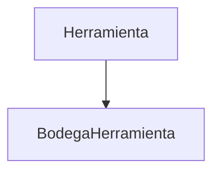

# **Gestión de Herramientas**

Los **registros de Herramientas** documentan las herramientas disponibles en el inventario, incluyendo su nombre, descripción, cantidad, estado y si están activas. Esta documentación cubre los endpoints RESTful para su gestión.

---

## **Endpoints de la API**

### **GET /inventario/herramientas/**
<p> <strong>Método:</strong> <span class="sl-badge success small astro-avdet4wd">GET</span>  </p>
URL:
<section><pre data-language="http" tabindex="0"><code>http://127.0.0.1:8000/inventario/herramientas/</code></pre></section>

Obtiene todas las herramientas registradas.

**Ejemplo de respuesta (200 OK):**
```json
[
  {
    "id": 1,
    "nombre": "Martillo",
    "descripcion": "Martillo de acero para uso general",
    "cantidad": 5,
    "estado": "Bueno",
    "activo": true
  }
]
```
**Parámetros opcionales:**
- `?nombre=Martillo`: Filtra por nombre de herramienta
- `?activo=true`: Filtra por herramientas activas

---

### **GET /inventario/herramientas/{id}/**
<p> <strong>Método:</strong> <span class="sl-badge success small astro-avdet4wd">GET</span>  </p>
URL:
<section><pre data-language="http" tabindex="0"><code>http://127.0.0.1:8000/inventario/herramientas/{id}/</code></pre></section>

Obtiene una herramienta específica por su ID.

**Ejemplo de respuesta (200 OK):**
```json
{
  "id": 1,
  "nombre": "Martillo",
  "descripcion": "Martillo de acero para uso general",
  "cantidad": 5,
  "estado": "Bueno",
  "activo": true
}
```

---

### **POST /inventario/herramientas/**
<p> <strong>Método:</strong> <span class="sl-badge success small astro-avdet4wd">POST</span>  </p>
URL:
<section><pre data-language="http" tabindex="0"><code>http://127.0.0.1:8000/inventario/herramientas/</code></pre></section>

Registra una nueva herramienta en el inventario.

**Ejemplo de solicitud:**
```json
{
  "nombre": "Destornillador",
  "descripcion": "Destornillador de punta fina",
  "cantidad": 10,
  "estado": "Nuevo",
  "activo": true
}
```

**Validaciones:**
- Campos obligatorios: `nombre`, `descripcion`, `cantidad`, `estado`
- `cantidad` debe ser un entero
- `activo` es opcional (por defecto `true`)

**Respuesta exitosa (201 Created):**
```json
{
  "id": 2,
  "nombre": "Destornillador",
  "descripcion": "Destornillador de punta fina",
  "cantidad": 10,
  "estado": "Nuevo",
  "activo": true
}
```

---

### **PUT /inventario/herramientas/{id}/**
<p> <strong>Método:</strong> <span class="sl-badge success small astro-avdet4wd">PUT</span>  </p>
URL:
<section><pre data-language="http" tabindex="0"><code>http://127.0.0.1:8000/inventario/herramientas/{id}/</code></pre></section>

Actualiza una herramienta existente.

**Ejemplo de solicitud:**
```json
{
  "cantidad": 8,
  "estado": "Usado"
}
```

**Restricciones:**
- Todos los campos son modificables

---

### **DELETE /inventario/herramientas/{id}/**
<p> <strong>Método:</strong> <span class="sl-badge success small astro-avdet4wd">DELETE</span>  </p>
URL:
<section><pre data-language="http" tabindex="0"><code>http://127.0.0.1:8000/inventario/herramientas/{id}/</code></pre></section>

Elimina una herramienta del inventario.

**Respuesta exitosa (204 No Content):**
```json
{}
```

**Error común (404 Not Found):**
```json
{
  "detail": "No encontrado."
}
```

---

## **Códigos de estado comunes:**
| Código | Descripción |
|--------|-------------|
| `200` | OK (GET, PUT, DELETE exitoso) |
| `201` | Created (POST exitoso) |
| `400` | Bad Request (datos inválidos) |
| `404` | Not Found (herramienta no encontrada) |
| `409` | Conflict (restricción de integridad) |

---

## **Relaciones Clave**


---

## **Buenas Prácticas**
✔️ **Registro inmediato:** Actualizar la cantidad y estado tras cada uso o cambio.  
✔️ **Detalles específicos:** Incluir en `descripcion` características clave como tipo o tamaño.  
✔️ **Consistencia:** Mantener el estado actualizado según el uso real de la herramienta.  

---

## **Integraciones Comunes**
▸ **Notificaciones:** Alertas cuando la cantidad de herramientas cae por debajo de un umbral.  
▸ **Inventario:** Sincronización con `BodegaHerramienta` para reflejar disponibilidad por bodega.  
▸ **Reportes:**  
  - Estado general de herramientas  
  - Histórico de uso y modificaciones  

