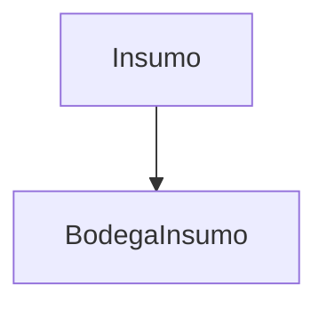

---
title: "Gestión de Insumos"
slug: modules/inventario/insumos
description: "Documentación de la API para la gestión de insumos en Agrosoft."
---

# **Gestión de Insumos**

Los **registros de Insumos** documentan los insumos disponibles en el inventario, incluyendo su nombre, descripción, cantidad, unidad de medida y si están activos. Esta documentación cubre los endpoints RESTful para su gestión.

---

## **Endpoints de la API**

### **Obtener todos los insumos**

<p><strong>Método:</strong> <span class="sl-badge success small astro-avdet4wd">GET</span></p>

URL:
<section id="tab-panel-58" aria-labelledby="tab-58" role="tabpanel">
  <div class="expressive-code">
    <figure class="frame not-content">
      <pre data-language="http" tabindex="0"><code><div class="ec-line"><div class="code">http://127.0.0.1:8000/inventario/insumo/</div></div></code></pre>
      <div class="copy"><button title="Copiar al portapapeles" data-copied="¡Copiado!" data-code="http://127.0.0.1:8000/inventario/insumo/"><div></div></button></div>
    </figure>
  </div>
</section>

**Parámetros opcionales:**
- `?nombre=Fertilizante`: Filtra por nombre de insumo.
- `?activo=true`: Filtra por insumos activos.

**Ejemplo de respuesta (200 OK):**
```json
[
  {
    "id": 1,
    "nombre": "Fertilizante NPK",
    "descripcion": "Fertilizante balanceado para cultivos",
    "cantidad": 50,
    "unidad_medida": "kg",
    "activo": true
  }
]
```

---

### **Obtener un insumo por ID**

<p><strong>Método:</strong> <span class="sl-badge success small astro-avdet4wd">GET</span></p>

URL:
<section id="tab-panel-58" aria-labelledby="tab-58" role="tabpanel">
  <div class="expressive-code">
    <figure class="frame not-content">
      <pre data-language="http" tabindex="0"><code><div class="ec-line"><div class="code">http://127.0.0.1:8000/inventario/insumo/{id}/</div></div></code></pre>
      <div class="copy"><button title="Copiar al portapapeles" data-copied="¡Copiado!" data-code="http://127.0.0.1:8000/inventario/insumo/{id}/"><div></div></button></div>
    </figure>
  </div>
</section>

**Ejemplo de respuesta (200 OK):**
```json
{
  "id": 1,
  "nombre": "Fertilizante NPK",
  "descripcion": "Fertilizante balanceado para cultivos",
  "cantidad": 50,
  "unidad_medida": "kg",
  "activo": true
}
```

---

### **Registrar un nuevo insumo**

<p><strong>Método:</strong> <span class="sl-badge success small astro-avdet4wd">POST</span></p>

URL:
<section id="tab-panel-58" aria-labelledby="tab-58" role="tabpanel">
  <div class="expressive-code">
    <figure class="frame not-content">
      <pre data-language="http" tabindex="0"><code><div class="ec-line"><div class="code">http://127.0.0.1:8000/inventario/insumo/</div></div></code></pre>
      <div class="copy"><button title="Copiar al portapapeles" data-copied="¡Copiado!" data-code="http://127.0.0.1:8000/inventario/insumo/"><div></div></button></div>
    </figure>
  </div>
</section>

**Ejemplo de solicitud:**
```json
{
  "nombre": "Pesticida",
  "descripcion": "Pesticida orgánico para plagas",
  "cantidad": 20,
  "unidad_medida": "litros",
  "activo": true
}
```

**Validaciones:**
- Campos obligatorios: `nombre`, `descripcion`, `cantidad`, `unidad_medida`
- `cantidad` debe ser un entero
- `activo` es opcional (por defecto `true`)

**Ejemplo de respuesta (201 Created):**
```json
{
  "id": 2,
  "nombre": "Pesticida",
  "descripcion": "Pesticida orgánico para plagas",
  "cantidad": 20,
  "unidad_medida": "litros",
  "activo": true
}
```

---

### **Actualizar un insumo**

<p><strong>Método:</strong> <span class="sl-badge success small astro-avdet4wd">PUT</span></p>

URL:
<section id="tab-panel-58" aria-labelledby="tab-58" role="tabpanel">
  <div class="expressive-code">
    <figure class="frame not-content">
      <pre data-language="http" tabindex="0"><code><div class="ec-line"><div class="code">http://127.0.0.1:8000/inventario/insumo/{id}/</div></div></code></pre>
      <div class="copy"><button title="Copiar al portapapeles" data-copied="¡Copiado!" data-code="http://127.0.0.1:8000/inventario/insumo/{id}/"><div></div></button></div>
    </figure>
  </div>
</section>

**Ejemplo de solicitud:**
```json
{
  "cantidad": 15,
  "activo": false
}
```

**Restricciones:**
- Todos los campos son modificables

**Ejemplo de respuesta (200 OK):**
```json
{
  "id": 1,
  "nombre": "Fertilizante NPK",
  "descripcion": "Fertilizante balanceado para cultivos",
  "cantidad": 15,
  "unidad_medida": "kg",
  "activo": false
}
```

---

### **Eliminar un insumo**

<p><strong>Método:</strong> <span class="sl-badge success small astro-avdet4wd">DELETE</span></p>

URL:
<section id="tab-panel-58" aria-labelledby="tab-58" role="tabpanel">
  <div class="expressive-code">
    <figure class="frame not-content">
      <pre data-language="http" tabindex="0"><code><div class="ec-line"><div class="code">http://127.0.0.1:8000/inventario/insumo/{id}/</div></div></code></pre>
      <div class="copy"><button title="Copiar al portapapeles" data-copied="¡Copiado!" data-code="http://127.0.0.1:8000/inventario/insumo/{id}/"><div></div></button></div>
    </figure>
  </div>
</section>

**Ejemplo de respuesta exitosa (204 No Content):**
```json
{}
```

---

## **Manejo de Errores**

### **Ejemplo de error (404 Not Found):**
```json
{
  "detail": "No encontrado."
}
```

### **Ejemplo de error (400 Bad Request):**
```json
{
  "error": "Bad Request",
  "detail": "El campo 'cantidad' debe ser un entero."
}
```

---

## **Buenas Prácticas**

✔️ **Registro inmediato:** Actualizar la cantidad tras cada uso o reabastecimiento.  
✔️ **Detalles específicos:** Incluir en `descripcion` el tipo o propósito del insumo.  
✔️ **Consistencia:** Asegurar que `unidad_medida` sea coherente con la cantidad registrada.

---

## **Integraciones Comunes**

▸ **Notificaciones:** Alertas cuando la cantidad de insumos cae por debajo de un umbral.  
▸ **Inventario:** Sincronización con `BodegaInsumo` para reflejar disponibilidad por bodega.  
▸ **Reportes:**  
    • Stock por unidad de medida  
    • Histórico de uso y reabastecimiento  

---

## **Relaciones Clave**

